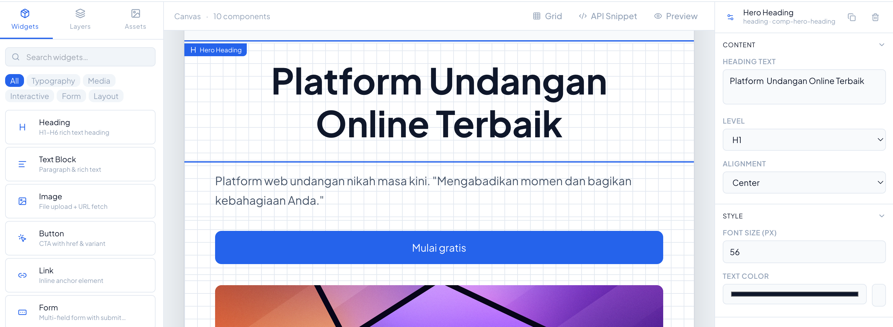

# NIQAH Editor


NIQAH editor is a Laravel package that serves as the architectural foundation for the NIQAH dynamic page editor ecosystem. Designed for specific internal business purposes, it provides a flexible engine for managing modular block components.

## Installation

You can install the package via composer:

```bash
composer require azmanabdlh/niqah-editor
```


You can publish the config file with:

```bash
php artisan vendor:publish --tag="niqah_editor-config"
```

This is the contents of the published config file:

```php
return [
  // ...
];
```

You can publish and run the migrations with:
```php
php artisan vendor:publish --tag="niqah_editor-migrations"
php artisan migrate
```


## Usage

```php
<?php

use NIQAHEditor\Facades\Engine;
use NIQAHEditor\View\Components\Hero;

Engine::registerComponent(new Hero());


Engine::editor('1.0.0')->toJSON();
// Output
// {
//     "version": "1.0.0",
//     "activeComponents": [],
//     "blockComponents": [
//         {
//             "name": "Hero",
//             "description": "example..",
//             "blockComponent": {
//                 "id": "none",
//                 "node": "div",
//                 "type": "__Container",
//                 "attributes": [],
//                 "children": []
//             },
//             "thumbnail": "example.com/hero.jpg"
//         }
//     ]
// }

```

Alternatively, you can retrieve active components from a specific Page in the database to be rendered in the editor.

```php
<?php

// app/Http/Controllers/PageController.php

$activeComponents = \App\Models\Page::find(1)->blockComponents();

Engine::editor('1.0.0', $activeComponents)->toJSON();


// app/Model/BlockComponent.php
class BlockComponent extends Model
{
  use InteractsWithComponent;
}


$blockComponent = BlockComponent::random();
// or
$blockComponent = BlockComponent::findByClassName(Hero::class);

$blockComponent->isLive();
// Output
// true

$blockComponent->data;
// Output
// [
//   {
//     "id": "none",
//     "node": "div",
//     "type": "__Container",
//     "attributes": [],
//     "children": []
//   }
// ]


```
Alternatively, you can register and integrate additional component classes for use within the editor.

```php
<?php
// app/Http/Controllers/PageController.php


// BlockComponent::all()->toComponent();
// or
$widgets = \App\Models\Widget::all();

Engine::adoptComponents(
  $this->parseToBlockComponents($widgets)
);

Engine::editor('1.0.0');

```

## Testing

```bash
composer test
```

## Changelog

Please see [CHANGELOG](CHANGELOG.md) for more information on what has changed recently.

## Contributing

Please see [CONTRIBUTING](CONTRIBUTING.md) for details.

## Security Vulnerabilities

Please review [our security policy](../../security/policy) on how to report security vulnerabilities.

## Credits

- [Azman Abdlh](https://github.com/azmanabdlh)

## License

The MIT License (MIT). Please see [License File](LICENSE.md) for more information.
